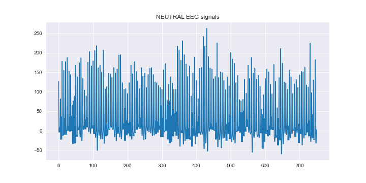
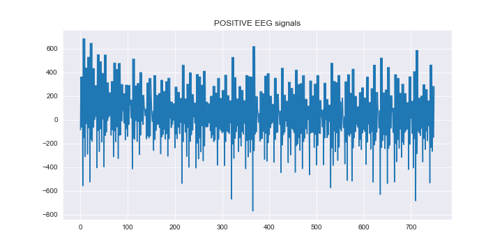
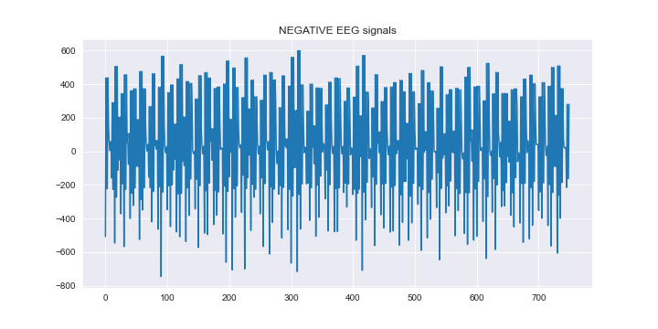
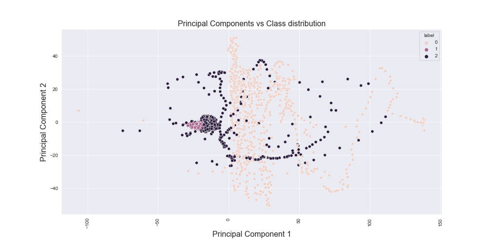
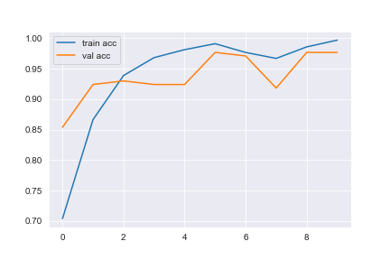
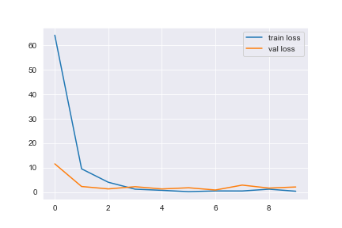

# EEG Emotion Classifictaion using LSTM
In this notebook i used  a LSTM model  to accurately predict the emotional states of a subject while watching various movie scenes given their EEG readings that shows person has NEGATIVE , NEUTRAL , POSITIVE feelings

https://www.researchgate.net/publication/329403546_Mental_Emotional_Sentiment_Classification_with_an_EEG-based_Brain-machine_Interface

https://www.researchgate.net/publication/335173767_A_Deep_Evolutionary_Approach_to_Bioinspired_Classifier_Optimisation_for_Brain-Machine_Interaction

## Overview

### 1) Understand the data (Shape , missing values , data types )

### 2) Data Visualization 

### 3) Data Preprocessing 

### 4) Implement PCA clustering analysis

##  5) Implement LSTM

##  6) Testing model

## Libraries used in the notebook

- [seaborn](https://seaborn.pydata.org/)
- [matplotlib](https://matplotlib.org/)
- [numpy](https://numpy.org/)
- [pandas](https://pandas.pydata.org/)
- [sklearn](https://scikit-learn.org/stable/)
- [tensorflow 2.x](https://www.tensorflow.org/)

## Data Visualization 
In this part  I visualize the data to have a better understanding of the data using [matplotlib](https://matplotlib.org/), [seaborn](https://seaborn.pydata.org/)
  

## Implement PCA clustering analysis

## LSTM Model Performance

  

  

***loss: 0.0279 - accuracy: 0.9967 - val_loss: 2.0245 - val_accuracy: 0.9766***

